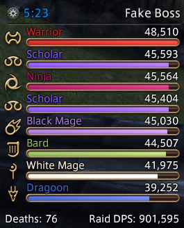
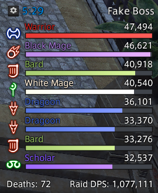
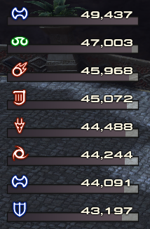
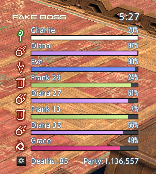
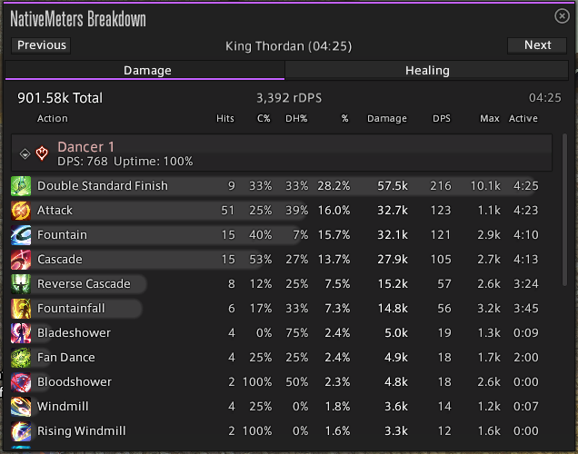
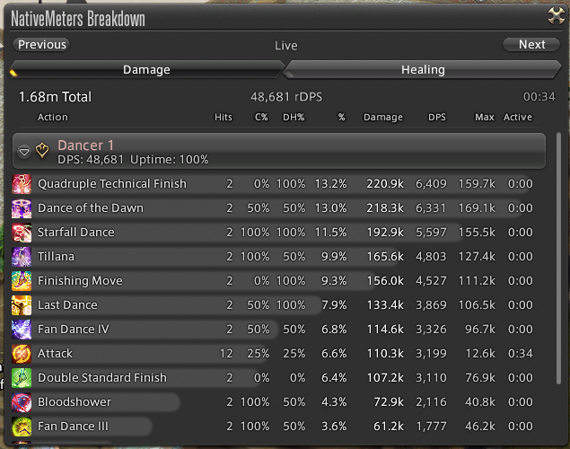

# NativeMeters

Meters that feel like part of the game. Who needs ImGui when you have AtkNodes?

  
  
  

## Description
Native DPS Meters for Final Fantasy XIV, this uses KTK.
You can fully customize the meters and their appearance (it will use any UI theme you may have installed through Penumbra).

> [!CAUTION]
> This plugin is in early development (beta) and may contain bugs and may reset your settings in the future (but I highly avoid that).

## Installation
1. Open the Dalamud settings by typing `/xlsettings` in-game.
2. Go to the **Settings** tab.
3. Add the following URL to your Custom Plugin Repositories:
   `https://raw.githubusercontent.com/Zeffuro/MyDalamudPlugins/master/repo.json`
4. Search for **NativeMeters** in the Plugin Installer.
